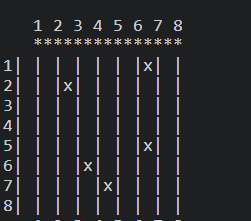
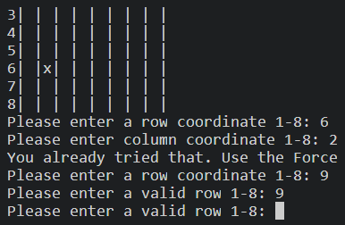
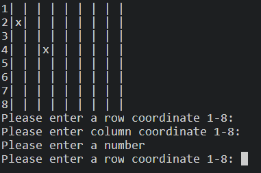
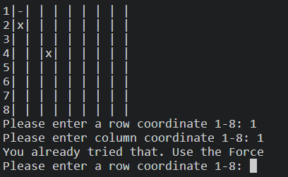

# Battle Star!

Battle Star is a Python terminal game, which runs in the Code Institute mock terminal on Heroku

Users have a laser cannon primed with ten charges. With these they must hit the Deathstar's vital points to save the Universe. Each vital point is represented by one square on the board.

## How to play

Battle Star is based on the classic Battleship game. You can read more on this [here](https://en.wikipedia.org/wiki/Battleship_(game))

In this version, two boards are randomly generated.

The player can see a grid of potential targets and is prompted to input the coordinates for the points on the grid that they believe are any weakpoints.

Successful hits are represented by an 'x' while misses are represented by a '-'.

Five successful strikes and the player wins. Ten misses and they are out of ammunition, resulting in a game over.

## Features

### Existing Features

* Random Board Generation
 * Targets are populated to the computer's grid at random.
 * The player cannot see the computer's targets.

* Play against the computer
* Accepts user inputs

* Input validation and error checking
 * You cannot enter coordinates outside the size of the grid

 
 * You must enter numbers

 

 * You cannot enter the same guess twice

 

### Future Features

* Allow multiplayer
* Allow the Empire to strike back
* Allow players control over target placement

## Data Model

I used a Battleboard class containing the method for define the boards and a Deathstar class containing functions for the creation of targets and the tracking of successful hits.

Functions were defined for recieving inputs and managing game logic.

## Testing

I manually tested the project by doing the following:
* Passed the code through the PEP8 Linter and confirmed there are no problems

* Tested invalid inputs, out of bound inputs and the same input twice
* Tested the project in my local terminal

## Bugs
The target creation method was problematic do to incorrect indentation. 

## Remaining Bugs
No remaining Bugs

## Credits
* Wikipedia for game rules
* [ArjanCodes](https://www.youtube.com/watch?v=u3yo-TjeIDg) for tips on refactoring
* [Knowledge Mavens](https://www.youtube.com/@KnowledgeMavens) for tips on converting functions to object oriented code and board creation using list comprehension, set notation and  ".join"

