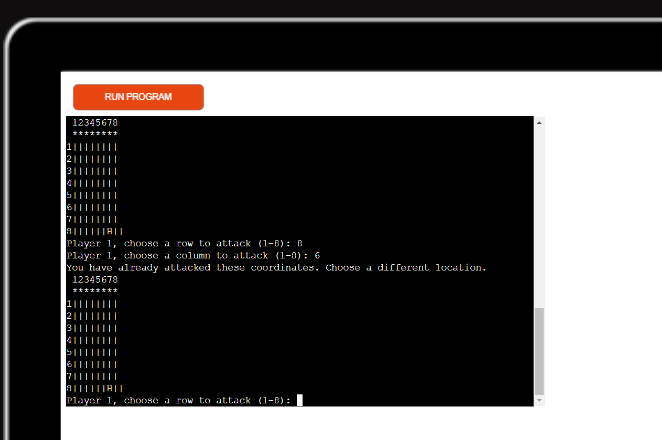

# Battle Star!

Battle Star is a Python terminal game, which runs in the Code Institute mock terminal on Heroku

Users have a laser cannon primed with ten charges. With these they must hit the opponents  weak points to save the Universe. Each vital point is represented by one square on the board.

## How to play

Battle Star is based on the classic Battleship game. You can read more on this [here](https://en.wikipedia.org/wiki/Battleship_(game))

In this version, two boards are generated and populated by the players.

The players can see grids of potential targets and are prompted to input the coordinates for the points on the grid that they believe are opposing weak points.

Successful hits are represented by an 'H' while misses are represented by a 'M'.

Five successful strikes and the player wins.

## Features

### Existing Features

* Two Player Board Generation
 * Players are prompted to manually input ship placements.
 * The player cannot see the opponents ship placement.

* Input validation and error checking
 * You cannot enter coordinates outside the size of the grid

 
 * You must enter numbers

 

 * You cannot enter the same guess twice

 

### Future Features

* Allow a 1 player mode against the computer.
* Create a more attractive user interface.

## Data Model

The game is built using three classes: BattleBoard, Player and GameLogic. The BattleBoard class contains the methods for defining and printing the player boards as well as hiding the opponent's weak point placements. The Player class contains the methods for creating the player boards, manual ship placement, and attack logic and input validation. The GameLogic class contains the methods for running the game and test for game over.

## Testing

I manually tested the project by doing the following:
* Each player move was tested by inputting coordinates for both players. The coordinates did not mutate during the runtime.
* The out of bounds potentiality was tested by inputing invalid coordinates and testing for the error warning.
* The ValueError functionality was tested by attempting to input non-integer values (i.e.: letters & symbols).
* Redundant attack coordinates were input to test the correlating error function.
* Player weakpoint coordinates were input to ensure that players cannot attack their own weak points. 
* Passed the code through the PEP8 Linter and confirmed there are some issues with the line length of the notes.

* Tested invalid inputs, out of bound inputs and the same input twice
* Tested the project in my local terminal
* Tested on Heroku hosting site. You can find the live application [here](https://battlestar-5603f3628e7a.herokuapp.com/)

## Bugs
* The target creation method was problematic do to incorrect indentation. 
* The player boards load with weakness placement displayed.

## Remaining Bugs
* No remaining Bugs

## Credits
* Wikipedia for game rules
* [ArjanCodes](https://www.youtube.com/watch?v=u3yo-TjeIDg) for tips on refactoring
* [Knowledge Mavens](https://www.youtube.com/@KnowledgeMavens) for tips on converting functions to object oriented code and board creation using list comprehension, set notation and  ".join"

### Deployment

#### Version Control

The site was created using the Gitpod and pushed to github to the remote repository ‘Battle-Star’.

The following git commands were used throughout development to push code to the remote repo:

* git add . <file> - This command was used to add the file(s) to the staging area before they are committed.

* git commit -m “commit message” - This command was used to commit changes to the local repository queue ready for the final step.

* git push - This command was used to push all committed code to the remote repository on github.

#### Heroku Deployment
The site was deployed to Heroku automatically from Github. The steps to deploy are as follows:

* From your Heroku dashboard, select the app that you want to deploy from GitHub.
* Fom the app's detail page, select the Deploy tab. On that tab, you can choose a deployment method and configure the app to integrate with GitHub

The live link can be found :[here](https://battlestar-5603f3628e7a.herokuapp.com/) Live Site

#### Run Locally
Navigate to the GitHub Repository you want to clone to use locally:

* Click on the code drop down button
* Click on HTTPS
* Copy the repository link to the clipboard
* Open your IDE of choice (git must be installed for the next steps)
* Type git clone copied-git-url into the IDE terminal
* The project will now have been cloned on your local machine for use.

